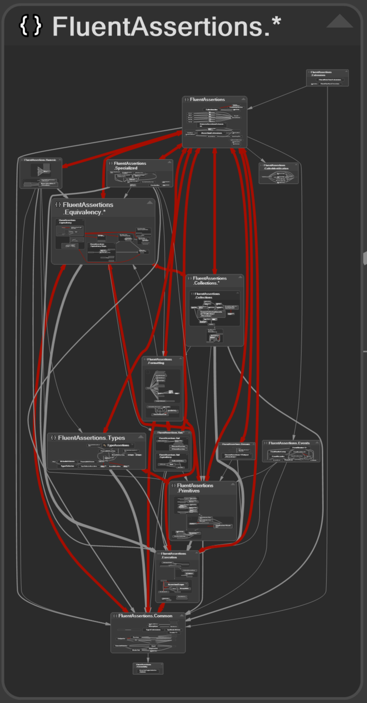
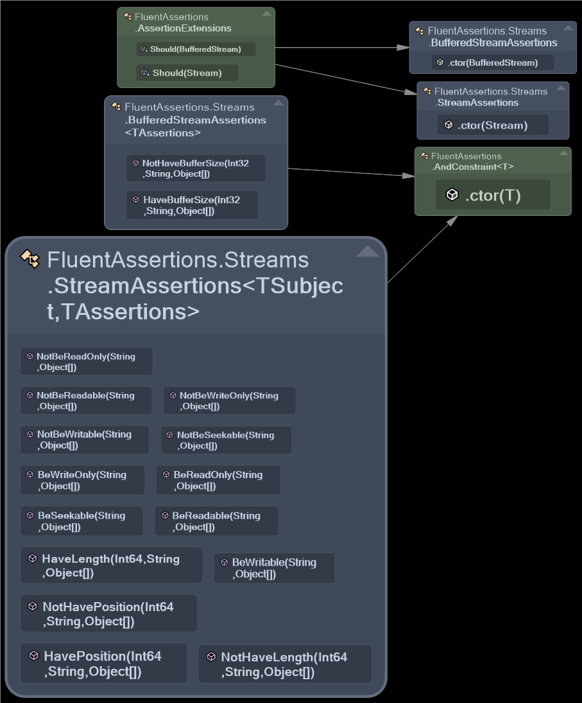

# Fluent Assertions assessment using NDepend

In line with the [CodeScene](hotspots_codescene.md) analysis this is now intended such that it can be read as a
standalone article. Before going into the actual data I'll start explaining some of the mechanics of NDepend rules and
data in this section. The analysis chapter limits itself to this low hanging fruit. The conclusions more close aim to
identify refactoring targets or there's for certain phases. It closes with a short conclusion about the usage and value
of NDepend itself.

## NDepend Rules, Issues and Quality Gates

NDepend uses a similar approach as CodeScene of rules that result in certain error levels. Some key differences are that
it:

- Doesn't take into account git data as a temporal dimension.
  - It does have time based trends, but that is based on the individual runs of the analysis and not on commits.
- Has a much vaster ruleset.
- Allows for writing your own rules.

To understand the reported numbers some explanation is required about the rules and their output. The basis as mentioned
above are rules. Rules are written in Code Query Language which an NDepends DSL based on LINQ. Rules are stacked, i.e.
there are `Quality Gate` rules that count the result of `Issue` rules. But there are also rules, or maybe just queries
that assist in the analysis for refactoring purposes.

An `Issue` rule is one that is defined to trigger a violation warning if the result of the query is not empty. There is
an added distinction which is that rules can be defined as `Critical`. These are by default used in a `Quality Gate`
rule that fails if there are `Critical` rule violations.

## Debt and interest

All the `Issue` rules return a [Debt](https://www.ndepend.com/docs/technical-debt) value (which is the estimated time to
fix the issue) and the accrued yearly [interest](https://www.ndepend.com/docs/technical-debt#Severity). Depending on the
amount of debt a Severity is determined using threshold levels. It is possible to fine-tune Debt calculation and
thresholds but that's beyond the scope of this analysis so I will use the defaults.

_Now they cleary state the values are estimates. It's not clear however if for instance certain estimates are based on
research._ _They refer to the SQALE method which is then used to implement
[debt ratio & rating](https://www.ndepend.com/docs/technical-debt#DebtRating)_ _I'm trying to calculate the ration
myself but the explanation is simply not clear to me!_

# Data Analysis

NDepend generates an HTML report which can be found [here](../data/ndepend/NDependOut/NDependReport.html). This report
also contains many of the Query Results so these can be browsed without having the actual tooling itself.

## Types to fix

NDepend has it's `Types to fix` query, see the
[results](../data/ndepend/NDependOut/NDependReport.html#QSQuery3873301436). The hotspots query selects any class that it
considers contains technical debt and accrues interest. The types to fixes only shows those types that have a debt value
of more than 30 minutes and is ordered by the breaking point. The
[breaking point](https://www.ndepend.com/docs/technical-debt#BreakingPoint) is: _the debt divided by the
annual-interest._ So if the cost of fixing it is low while the cost of leaving it is high, the breaking point is lower,
thus paying off the debt is considered most valuable here.

For readability let's limit the results to the types which have a breaking point of less than a year and add some
temporal data of the last 18 months to it to see what types have been most frequently changed.

| Types                                                                                     | Breaking Point | Debt     | Annual Interest | 18M ChangeFreq |
| ----------------------------------------------------------------------------------------- | -------------- | -------- | --------------- | -------------- |
| FluentAssertions.Equivalency.EquivalencyValidator                                         | 244d           | 1h 11min | 1h 47min        | 12             |
| FluentAssertions.Equivalency.Steps.GenericDictionaryEquivalencyStep                       | 249d           | 1h 28min | 2h 8min         | 11             |
| FluentAssertions.Formatting.Formatter                                                     | 188d           | 50min    | 1h 37min        | 9              |
| FluentAssertions.AssertionOptions                                                         | 192d           | 1h 16min | 2h 24min        | 8              |
| FluentAssertions.Common.StringExtensions                                                  | 182d           | 54min    | 1h 49min        | 6              |
| FluentAssertions.Common.Services                                                          | 273d           | 1h 38min | 2h 10min        | 6              |
| FluentAssertions.Formatting.FormattedObjectGraph                                          | 152d           | 42min    | 1h 40min        | 4              |
| FluentAssertions.Collections.MaximumMatching.MaximumMatchingSolver<TValue >+Match         | 191d           | 44min    | 1h 24min        | 4              |
| FluentAssertions.Equivalency.Steps .GenericEnumerableEquivalencyStep                      | 147d           | 57min    | 2h 22min        | 3              |
| FluentAssertions.Equivalency.SelfReferenceEquivalencyOptions <TSelf>+Restriction<TMember> | 313d           | 35min    | 40min           | 1              |
| FluentAssertions.Equivalency.Tracing.GetTraceMessage                                      | 332d           | 50min    | 54min           | 1              |

The debt & interest on a type is the aggregate value of the debt & interest of all issues for that type. The breaking
point is mostly determined by the issues with a higher severity due to those having a higher interest and a low Debt
value. Even when taking the change frequency into account it just a limited set of recurring rules critical or high
severiy rules that is violated. Understanding those in determining a prioritization of refactoring is then more
valuable. So let's look at those in the next two sections

## Issue Severity Targets

There are no Blocker issues which NDepend defines as _cannot move to production_. The next level is critical, which
_should not move to production_.

### Critical severity issues

There is only rule that results in critical severity that triggers: `ND1213:Avoid types initialization cycles`. This
rule related to **static** type initialization and more is explained in
[this article](https://codeblog.jonskeet.uk/2012/04/07/type-initializer-circular-dependencies/) where the rule points
to.

The types reported are:

- `AssertionOptions`
- `GenericDictionaryEquivalencyStep`
- `GenericEnumerableEquivalencyStep`

It is the `AssertionOptions` static type initialization that is intertwined with the static type initializers of the
`EquivalencySteps`. The Options are also identified as an element that requires change.

## Critical rule targets

As mentioned there is a set of rules that are considered critical. Now these rules can return results with varying
severity because each returned code element can contain varying levels of `Annual Interest`. There are 5 critial rules
violated, see the results [here](../data/ndepend/NDependOut/NDependReport.html#QGSQuery3682185683). Let's look at them
individually.

### [ND1000](https://www.ndepend.com/default-rules/NDepend-Rules-Explorer.html?ruleid=ND1000): Avoid types too big (1)

The types too big returns the `NumericAssertionsExtensions`. It has a health score of 6 in CodeScene although it's not
part of it's limited list. Given it's merely static extension method it would not be difficult to split up but it would
break discoverability of the fluent interface.

### [ND1003](https://www.ndepend.com/default-rules/NDepend-Rules-Explorer.html?ruleid=ND1003): Avoid methods too big, too complex (1)

This identifies the XmlValidator.Validate() method as being too complex with a Cyclomatic Complexity score of 22. This
is also reported in CodeScene with a health 8 and this method indeed as being too complex. It doesn't seem to be
affected by any near term changes. So this is mostly a candidate on the medium longer term.

### [ND1400](https://www.ndepend.com/default-rules/NDepend-Rules-Explorer.html?ruleid=ND1400): Avoid namespaces mutually dependent (210)

The amount of mutual dependencies is obviously the most striking violation. This deserves a further analysis chapter in
itself. But it's already obvious that a refactoring here implies moving code and thus causes breaking changes when those
classes are part of the public interface.

### [ND1901](https://www.ndepend.com/default-rules/NDepend-Rules-Explorer.html?ruleid=ND1901): Avoid non-readonly static fields (4)

One of the reported classes here is `AssertionOptions` which is also involved in the Critical issues. One of the other
classes reported: `FluentAssertions.Common.Services` is called from this `AssertionOptions` class. The `Services` class
is also mentioned in issue
[#2291 Combine Configuration, Services and AssertionOptions](https://github.com/fluentassertions/fluentassertions/issues/2291)
so it makes sense to identify this as a refactoring target.

### [ND2012](https://www.ndepend.com/default-rules/NDepend-Rules-Explorer.html?ruleid=ND2012): Avoid having different types with same name (1)

These are two classes named Node where one (`FluentAssertions.Xml.Equivalency.Node`) is internal and essentially an
`XmlNode`. Simply rename would resolve this.

# Mutual namespace dependencies

The effect of mutual dependent namespace is probably best illustrated by the dependency graph shown by NDepend, see the
image below. Now before doing a further analysis of this rule let's reason a bit about it's definition & application.

## Definition

The rule says low level namespaces should not depend on high level namespaces. I was initially suspecting that such
implies that FluentAssertions is considered the lowest level namespace and FluentAssertions.Primitive is then a higher
level namespace. However it is calculated in a different way, lowest level namespaces are those of a pair that have
highest Afferent Coupling within a mutually dependent pair. This is also referred to as Fan In coupling. So let's say
there's a pair with given coupling cardinality `FluentAssertions 2 <-> 10 FluentAssertions.Primitives` then the
FluentAssertions.Primitives namespace would be considered the low level namespace.

## Application

The rationale behind the rule is that a layered architecture is easier to understand and maintain. The
[documentation](https://www.ndepend.com/default-rules/NDepend-Rules-Explorer.html?ruleid=ND1400#!) of the rule also
points to their own [whitepaper](https://www.ndepend.com/Res/NDependWhiteBook_Namespace.pdf) on this subject. Mutual
depdendent namespaces make it harder to understand what the effect is of a change. It is also not possible to test parts
in isolation. Because all tests are written against the code public API these mutual dependencies have not lead to any
issues and is probably why they went unnoticed.

When an architecure is more layered it is relatively obvious that change impact is much higher on lower layer parts of
the architecture since they have more code dependening on it than higher level code. When making changes it is less
clear how responsibilities are distributed as well.

Although it being a critical rule, far from all issues returned have a high severity, only 18 out of 223 issues have a
higher severity and should thus have a lower breaking point (higher ROI) for fixing. The question is how easy this is in
regards to introducing breaking changes.

## The nature of the Fluent API

The Fluent API is essentially enabled by extension methods named `Should()`. All these extension methods reside in
`AssertionExtension` classes in the root namespace. They call into the sub namespaces to instantiate type specific
`Assertions` classes that enable the further fluency of the API. These fluent methods return `Constraint` types that
reside in the root as well. Hence a cycle that illustrated by the graph below that shows the types and methods involved
in this cycle between `FluentAssertions` <-> `FluentAssertions.Streams` namespaces.

Moving any code to break a cycle implies a breaking change, it will break millions of using statements. The root
namespace being essentially a mediator for all it's sub namespaces is an understandable and valid pattern. Moving the
`Constraints` to another shared namespace will have the same effect. The resolution here without introducing breaking
changes is to make interfaces for the `Constraint` types in shared namespace.

Another issue remains though, because there are `Assertions` classes that consume the `Should()` API. Because the should
API is static there is no decoupling possible through interfaces. The `Should` API is essentially a static service
locator returning concrete `Assertions` types. The only simple way here is to have Assertions not use this public API
and instantiate the specific `Assertions` they depend on themselves. Any other solution I see would involve not using
compile time binding. The complexity this adds hardly outweighs a benefit to breaking this cycle.

Although partially fixable I believe it shouldn't be the main priorty when it comes to reducing mutual dependencies.

## Compile time 'service' collections

Part of the mutual dependencies is caused by compile time binding of interface implementations. Specifically the
EquivalencySteps & the Formatters. In many scenario's this is done runtime using IoC containers and assembly scanning.
Here the `Formatter` and `EquivalencySteps` types are grouped together in a single namespaces. There are just some
slight deviations where either an implementation is not in the same namespace (`XmlNodeFormatter`) or the container
collection is not in the same namespace (`EquivalencyPlan`). These are relatively easy to fix altough it amount of
breaking changes should be assessed.

## Non public members

Filtering out all mutual dependencies where either the caller of callee is public two classes remain:

- `Services`
- `SelfReferenceEquivalencyOptions`

Both of these classes are also in the top 10 of the types to fix. So it's worth researching what can be resolved there.
The other `Options` suffixed classes that is in the top 10 of types to fix query is the `AssertionOptions`. Given that
the Options architecture is also under scrutiny and that change has already been classified as breaking fixing the
problems identified.

These are potentially not easiest to fix but given their relation to other parts and issues identified that relate to
changing the services and configuration it makes sense incorporate a fix to this issue.

# Conclusions

There is a big difference between that what NDepend brings up as debt and that what CodeScene comes up with. For this
conclusion I will initially limit myself to simply using the data that NDepend offers with some temporal data. If I
would go into an evaluation of every NDepend rule this will nearly become a never ending story. So certain outcomes are
debatable but I will use the default results from NDepend and divide them using a Now, Next, Later and Never division
the following prioritization of refactoring targets can be identified.

## Refactoring prioritization

### Now

It's NDepend that is pointing out some stuctural issues that really do coincide with changes in the Core. Based on the
outcomes most value is in addressing issues for:

- `Configuration`
- `Services`
- `AssertionOptions`
- `SelfReferenceEquivalencyOptions`
- `GenericDictionaryEquivalencyStep`
- `GenericEnumerableEquivalencyStep`

Of which all but `Configuration` are in the top 10 of types to fix. It could be optional to look at the NDepend issue
that might relate to desired changes in `AssertionScope`. However the ROI on that Debt is listed lower.

**Primary:**

- ND1213: Fix the type inialization cycle from the critical rule.
- ND1901: Fix if feasible.
- ND1400: Fix non public member dependency cycles.

**Secondary:** Mostly because these are easy fixes on critical rules.

- ND2012: Remove name conflict.

### Next

Given we're dealing with an open source library it can help if newer contributors pick up less urgent issues to get
acquainted with the codebase.

**Primary:**

Fix/filter remaining critical rules.

- ND1003: Reduce Complexity.
- ND1400:
  - Assess impact fixing mutual dependencies within sub namespaces. Equivalency & Collection namespaces would have more
    priority given issue forecast.
  - Filter out non fixes.

**Secondary:**

- ND1604: Types almost 100% tested should be 100% tested This is a High Severity rule thus it was not discussed. But
  valuable to put `up for grabs` for starters.

### Later

There are many more NDepend issues that could use attention. But those are lower priority. They could be put up for
grabs. But that is much more valuable when tools are integrated in the development process and have appropriate
adjustments to filter out the noise or what the team considers false positives.

### Never

Certain traits of the API are rather hard to refactor. This was seens in the CodeScene analysis and here as well. Those
results should be filtered when incorporating tools into a development workflow.

## NDepend

NDepend really shines in providing tools to identify and analyze structural issues. It's flexibity is a strength for
very project specific analysis & customizations. It has a lot of overlap in more detailed rules regarding code smells &
idioms that are also available in other static analysis tools such as SonarQube or Qodana. Unlike many other static
analysis tools however CQL provides the means to automate compliance to architecture & conventions. This is especially
very valuable in large project settings with many contributors. Transferring knowledge about such rules and validating
them manually in pull request is virtually impossible. Also the The DSM & Graphs are great tooling to analyze &
understand structural strengths & weaknesses.

Because this flexibility however that it has such a vast ruleset on different levels of granularity that assessing the
initial data is quite time consuming. Implementing NDepend on a running project will thus require a substantial amount
of time to analyze & adjust results. Although this is the case with introducing static analysis tools later in a project
the architectural rules add an extra level of complexity.

When it comes to it's prioritization numbers it's just estimates. Although the Debt rating is based on a SQALE method
the other numbers should be taken with a grain of salt. The time alone it took me to analyze individual violations
sometimes exceeded the Debt values. Although this is something you get better at over time steering blind on just the
NDepend prioritization is not the most valuable approach. Incorporating other aspect such as the temporal dimension and
a roadmap help trimming down the real critical parts.

Apart from not evaluating all rules, there's are rulesets that work on the temporal dimension are trends & delta rules.
One of this things that it can do with delta's is identifying API breaking changes. A facility that now is implemented
by running a specific set of tests. These trend rules also enable breaking CI on certain trend regressions.

NDepend is thus a very versatile tool that replace or complement others. I say complement because it's not having any
duplication detection nor does it has the ability to overlay temporal information on it's recommendations. But
especially in longer running projects with many contributors it can serve as a great way to sustain a quality baseline.
I've noticed in a few occasions that it's price can be a detracting factor. From my own experience I believe it will
provide enough ROI once you get over te learning curve. They do have an explicit support model for Open Source model.
They have shown however to be open to collaboration with open source projects. So there is a possibility for Open Source
.net projects to leverage it's value.
